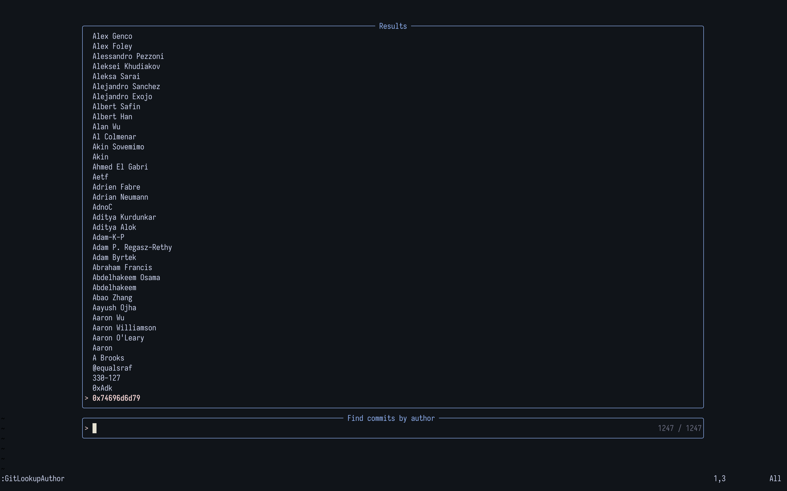

# `git-search.nvim`
Need a quick lookup in a git repo ?

## Requirements
This plugin requires `git` and [`telescope.nvim`](https://github.com/nvim-telescope/telescope.nvim)

## Available commands
### `:GitLookupAuthor`
Will open a prompt where you can fuzzy find an author name and it will display every commit linked to that author

Screenshots

### `:GitLookupRecent`
Will show the 100 most recent commits
